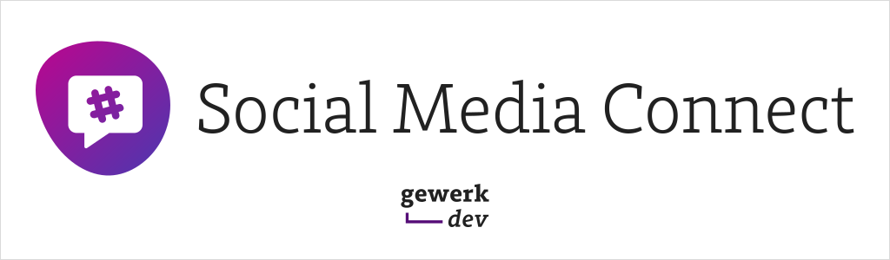

# Social Media Connect



Integrates Social Media services into your sites for publishing and displaying posts

## Features

* Connect Twitter, Instagram and Facebook Pages to your site
* Post directly to Twitter and Facebook from entries editor
* Pull content from Social Media into your site

## Requirements

This plugin requires Craft CMS 3.7 or later.

## Installation

You can install this plugin from the Plugin Store or with Composer.

### From the Plugin Store

Go to the Plugin Store in your project’s Control Panel and search for “Social Media Connect”. Then click on the “Install” button in its modal window.

### With Composer

Open your terminal and run the following commands:

```bash
# go to the project directory
cd /path/to/my-project.test

# tell Composer to load the plugin
composer require gewerk/social-media-connect

# tell Craft to install the plugin
./craft plugin/install social-media-connect
```

## Documentation

Visit [the plugin page](https://gewerk.dev/plugins/social-media-connect) for all documentation, guides and developer resources.

## Support

Get in touch with us via [the support page](https://gewerk.dev/support) or [by creating a GitHub issue](https://github.com/gewerk/social-media-connect/issues)
